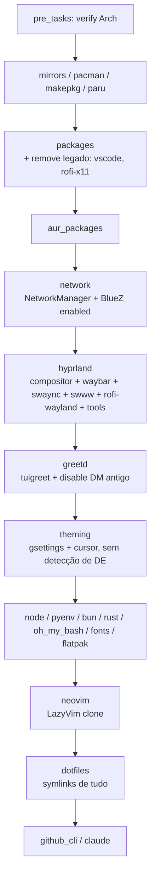
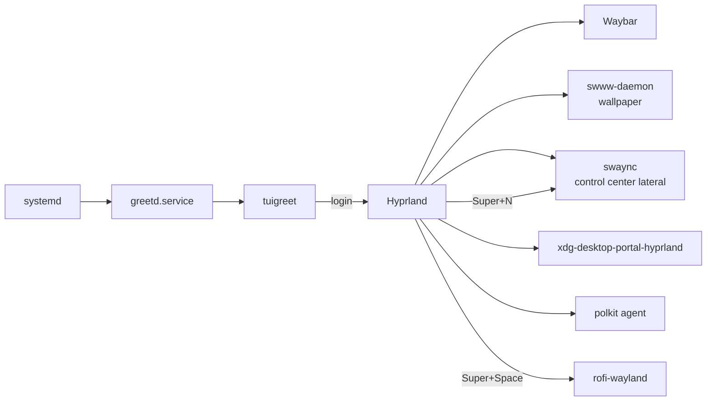

# SPEC Técnica — Migração dos dotfiles para Hyprland (rice grayscale)

> **Status:** rascunho para revisão
> **Data:** 2026-07-18
> **PRD de origem:** [`docs/prd-migracao-hyprland.md`](./prd-migracao-hyprland.md) (aprovado)
> **Card/épico:** N/A — repo pessoal, sem gerenciador de tarefas

## Perguntas em aberto

Nenhuma — as três pendências do PRD foram resolvidas (greetd+tuigreet, NetworkManager/BlueZ garantidos pelo playbook, GPU não-NVIDIA).

---

## 1. Resumo Técnico & Objetivos

Refatorar o playbook Ansible (`ansible/site.yml`) para provisionar **uma única máquina**: desktop Arch com Hyprland riced grayscale. O trabalho se divide em:

- **Remoções:** roles `ssh` e `podman`, `vars_prompt`/`install_profile`, `flatpak_apps_server`, `visual-studio-code-bin`, `script.sh`, e todos os ramos GNOME/XFCE das roles `theming` e `rofi`.
- **Roles novas:** `hyprland` (compositor + ecossistema Wayland), `greetd` (login), `network` (NetworkManager + BlueZ), `neovim` (LazyVim).
- **Configs novas em `base_config/`:** `hypr/`, `waybar/`, `swaync/`, `theme/` (paleta única), e tema Rofi grayscale — todas symlinkadas pela role `dotfiles` existente.
- **Docs:** README reescrito; `AGENT.md` removido (README passa a ser a única doc — o AGENT.md descreve um setup que não existe desde antes do Ansible).

Requisitos não-funcionais do PRD traduzidos em decisão técnica:

| NFR do PRD | Decisão técnica |
|---|---|
| Idempotência (`changed=0` no 2º run) | Módulos `pacman`/`file state=link`/`systemd` nativos onde possível; tasks shell só com `creates:`/checks `pacman -Q` (padrão já usado nas roles `rofi`/`theming`) |
| Paleta em um lugar só | Dicionário `theme_palette` em `group_vars/all.yml` → templates Jinja2 geram `colors.conf` (Hyprland), `colors.css` (Waybar+swaync) e `colors.rasi` (Rofi) |
| Animações fluidas | Beziers custom no `hyprland.conf` + `layerrule animation slide` para o swaync (o slide "de celular" é do Hyprland, não do CSS) |
| Segurança | Nenhum segredo novo; greetd roda como serviço systemd padrão; remoção do sshd só afeta esta máquina |

## 2. Arquitetura Proposta

### 2.1 Fluxo do playbook (novo `site.yml`)



Roles **removidas** do grafo: `ssh`, `podman`, prompt de perfil. Role `rofi` deixa de existir como role separada — o pacote entra na lista da role `hyprland` e o atalho vira linha de config.

### 2.2 Sessão em runtime



Autostart via `exec-once` no `hyprland.conf` (waybar, swww-daemon + wallpaper, swaync, polkit agent, hypridle, `wl-paste --watch cliphist store`).

### 2.3 Estrutura de arquivos alvo

```
base_config/
├── bash/bashrc                  # inalterado
├── fastfetch/                   # inalterado
├── ghostty/config               # inalterado (JetBrainsMono + Min Dark)
├── theme/                       # GERADO por template (não editar à mão)
│   ├── colors.conf              #   paleta p/ Hyprland ($bg, $surface, $border...)
│   ├── colors.css               #   @define-color p/ Waybar + swaync
│   └── colors.rasi              #   vars p/ Rofi
├── hypr/
│   ├── hyprland.conf            # source = conf.d/* ; source = ~/.config/theme/colors.conf
│   ├── conf.d/
│   │   ├── binds.conf           # todos os atalhos
│   │   ├── animations.conf      # beziers + animações
│   │   ├── decoration.conf      # blur, rounding, sombras, bordas
│   │   ├── rules.conf           # windowrules + layerrules (swaync slide)
│   │   └── autostart.conf       # exec-once
│   ├── hyprlock.conf
│   └── hypridle.conf
├── waybar/
│   ├── config.jsonc
│   └── style.css                # @import "../theme/colors.css"
├── swaync/
│   ├── config.json              # positionX: right, layer, largura do painel
│   └── style.css                # @import "../theme/colors.css"
└── rofi/
    ├── config.rasi
    └── spotlight-gray.rasi      # tema Spotlight adaptado, @import colors.rasi
```

A role `dotfiles` ganha os itens `hypr`, `waybar`, `swaync`, `theme` no loop de symlinks existente (`base_config/X → ~/.config/X`).

## 3. Contratos de API e Estrutura de Dados

Não há API/banco — os "contratos" deste repo são as variáveis do Ansible, os arquivos gerados e os binds.

### 3.1 `group_vars/all.yml` — variáveis novas

```yaml
# Paleta grayscale — ÚNICA fonte de verdade de cor do rice
theme_palette:
  bg:        "#0a0a0a"
  bg_alt:    "#121212"
  surface:   "#1a1a1a"
  surface2:  "#242424"
  border:    "#3a3a3a"
  border_hi: "#5a5a5a"
  text_dim:  "#8a8a8a"
  text:      "#d4d4d4"
  text_hi:   "#eeeeee"

hyprland_packages:        # instalados via paru, como todo o resto
  - hyprland
  - xdg-desktop-portal-hyprland
  - xdg-desktop-portal-gtk    # file picker p/ apps GTK
  - hyprlock
  - hypridle
  - hyprpolkitagent
  - waybar
  - swaync
  - rofi-wayland
  - swww
  - cliphist
  - grim
  - slurp
  - satty
  - wl-clipboard
  - brightnessctl
  - playerctl
  - pavucontrol
  - pipewire
  - pipewire-alsa
  - pipewire-pulse
  - wireplumber
  - qt5-wayland
  - qt6-wayland
  - noto-fonts
  - noto-fonts-emoji

desktop_apps:             # role apps (RF-21) — via paru + syncthing@user habilitado
  - onlyoffice-bin
  - gnome-calculator
  - syncthing
  - localsend-bin
  - firefox
  - chromium

network_packages: [networkmanager, bluez, bluez-utils]
network_services: [NetworkManager.service, bluetooth.service]

greetd_packages: [greetd, greetd-tuigreet]

neovim_packages: [neovim, ripgrep, fd, lazygit]
lazyvim_repo: "https://github.com/davieduardo001/lazyvim-config"
lazyvim_dest: "{{ ansible_env.HOME }}/.config/nvim"

# Pacotes legados a REMOVER (idempotente: absent)
packages_absent: [visual-studio-code-bin, rofi, rofi-themes-collection-git, brave-bin]
```

**Instalação sempre via paru** (pedido do Davi, inclusive ghostty): todas as roles que instalam pacote usam o padrão existente do repo — check `pacman -Q` + `paru -S --needed --noconfirm` como usuário — e por isso ficam **entre** as duas entradas `sudoers` do `site.yml` (janela NOPASSWD para `/usr/bin/pacman`). A role `packages` migra do módulo pacman para esse padrão e entra na janela. Única exceção: o bootstrap do próprio paru.

Variáveis **removidas:** `flatpak_apps_server`, `rofi_aur_packages`, `rofi_shortcut`, `rofi_command` (e o comentário do workaround XWayland).

### 3.2 Contrato da paleta (templates → arquivos)

| Template (role `theming`) | Saída (versionada no git) | Consumido por |
|---|---|---|
| `colors.conf.j2` | `base_config/hypr/colors.conf` — `$bg = rgb(0a0a0a)` ... | `hyprland.conf` e `hyprlock.conf` via `source =` |
| `colors.css.j2` | `base_config/waybar/colors.css` e `base_config/swaync/colors.css` — `@define-color bg #0a0a0a;` ... | `style.css` de cada um via `@import "colors.css"` (mesmo diretório) |
| `colors.rasi.j2` | `base_config/rofi/colors.rasi` — `bg: #0a0a0a;` ... | tema Rofi via `@import` |

Os arquivos renderizados ficam dentro de `base_config/` (commitados): import relativo no mesmo diretório funciona através do symlink, e mudança de paleta aparece como diff no git.

Trocar a paleta = editar `theme_palette` + re-rodar `--tags theming` (os templates só marcam `changed` quando o conteúdo muda — idempotência preservada).

### 3.3 `/etc/greetd/config.toml` (template, role `greetd`)

```toml
[terminal]
vt = 1

[default_session]
command = "tuigreet --time --remember --remember-session --cmd Hyprland"
user = "greeter"
```

A role habilita `greetd.service` e **desabilita** qualquer DM anterior detectado (`gdm`, `sddm`, `lightdm` — check `systemctl is-enabled`, disable sem falhar se ausente).

### 3.4 Mapa de keybinds (`hypr/conf.d/binds.conf`)

| Bind | Ação |
|---|---|
| `Super+Space` | `rofi -show drun` (nativo Wayland, tema spotlight-gray) |
| `Super+N` | `swaync-client -t -sw` (abre/fecha control center) |
| `Super+Return` | `ghostty` |
| `Super+Q` | fechar janela · `Super+F` fullscreen · `Super+T` toggle floating |
| `Super+1..9` / `Super+Shift+1..9` | ir para / mover janela para workspace |
| `Super+Shift+S` | `grim -g "$(slurp)" - \| satty -f -` (recorte → anotação no satty → Enter copia) |
| `Print` | `grim -g "$(slurp)" - \| wl-copy` (região → clipboard direto, sem editor) |
| `Shift+Print` | `grim ~/Pictures/...png` (tela cheia → arquivo) |
| `Super+V` | histórico do clipboard: `cliphist list \| rofi -dmenu \| cliphist decode \| wl-copy` |
| `Super+Escape` | `hyprlock` |
| `XF86Audio*` / `XF86MonBrightness*` | volume (wpctl) / brilho (brightnessctl) |

### 3.5 Control center lateral (swaync)

- `config.json`: `"positionX": "right"`, `"layer": "overlay"`, `"control-center-width": 420`, `"fit-to-screen": true`, widgets: `[title, dnd, mpris, volume, backlight, buttons-grid, notifications]`; `buttons-grid` com toggles wifi (`nmcli radio wifi`), bluetooth (`bluetoothctl power`), DND.
- **Animação de slide:** `layerrule = animation slide right, swaync-control-center` + `layerrule = blur, swaync-control-center` em `rules.conf` — quem anima o painel é o Hyprland (fluido, GPU), o CSS do swaync só cuida do visual grayscale.
- Fechamento por `Esc`/`Super+N` (mesmo comando, `-t` é toggle).

### 3.6 Role `neovim` — contrato de clone (RF-06)

```
1. pacman: neovim_packages (state: present)
2. stat ~/.config/nvim
   ├── não existe            → git clone {{ lazyvim_repo }} → changed
   ├── existe e é clone dele → git remote get-url origin == lazyvim_repo → ok (não toca)
   └── existe e NÃO é clone  → debug msg de aviso + NÃO sobrescrever (fail=false)
```

### 3.7 Role `theming` (reescrita, sem DE)

- Mantém instalação dos ícones/cursor AUR (padrão `pacman -Q` + `paru` já existente).
- Gera os 3 arquivos de cor (§3.2).
- Aplica GTK via `gsettings` (funciona sob Hyprland com dbus/dconf): `icon-theme`, `cursor-theme`, `gtk-theme`, `color-scheme prefer-dark` — sem ramo XFCE, sem detecção de `XDG_CURRENT_DESKTOP`.
- Cursor no compositor: `env = XCURSOR_THEME/XCURSOR_SIZE` no `hyprland.conf` (não é task).

## 4. Estratégia de Migração e Deploy

Sem feature flag e sem blue/green — é uma máquina só. A estratégia é **snapshot + ordem segura + rollback documentado**.

### 4.1 Ordem de implementação (PRs/commits lógicos)

1. **Limpeza** — remover `script.sh`, `AGENT.md`, roles `ssh`/`podman`, perfil/`vars_prompt`, `flatpak_apps_server`, vscode da lista (+`packages_absent`). Playbook segue verde no setup atual.
2. **Roles novas sem ativação** — `network`, `hyprland`, `neovim` + configs em `base_config/` + symlinks. Nada disso quebra a sessão GNOME/XFCE atual (Hyprland instalado fica só disponível).
3. **Rice** — paleta/templates, `hyprland.conf` completo, waybar/swaync/rofi tematizados. Validação manual: logar numa sessão Hyprland **via TTY (`Hyprland` no tty2)** antes de mexer no login.
4. **greetd por último** — só depois do passo 3 validado: desabilita DM antigo, habilita greetd. É o único passo com risco de lockout gráfico.
5. **Docs** — README novo, commit final.

### 4.2 Pré-deploy na máquina atual

- `timeshift` já é instalado pelo repo → **criar snapshot antes do passo 4**.
- Commitar a mudança pendente do Ghostty (fonte JetBrainsMono) junto ao passo 1.
- `packages_absent` remove `visual-studio-code-bin` e o `rofi` X11 da máquina atual (resolve o conflito com `rofi-wayland` antes da instalação — ordem garantida no `site.yml`: `packages` roda antes de `hyprland`).

### 4.3 Impacto em legado

- **GNOME/XFCE instalados:** o playbook não os desinstala (fora de escopo) — apenas deixam de ser o caminho de login. Removê-los depois é manual e opcional.
- **TV box existente:** não é tocada; ela simplesmente deixa de ter um playbook que a descreva (histórico no git, tag `pre-hyprland` recomendada antes do merge).
- **Symlinks antigos:** `~/.config/rofi` continua válido (mesmo path, tema novo). Nenhum symlink órfão esperado.

### 4.4 Rollback

| Cenário | Ação |
|---|---|
| Hyprland não presta / rice quebrado | Logar no tuigreet escolhendo sessão antiga (F2/F3 lista sessões `.desktop` disponíveis) ou `systemctl disable greetd && systemctl enable gdm` no TTY |
| Lockout gráfico total | TTY2 (`Ctrl+Alt+F2`) → `sudo systemctl disable greetd --now && sudo systemctl enable gdm --now` |
| Regressão geral | `git checkout pre-hyprland` + re-rodar playbook; ou restaurar snapshot timeshift |
| LazyVim ruim | `~/.config/nvim` é um clone independente — trocar/apagar não afeta o playbook |

## 5. Plano de Testes e Riscos

### 5.1 Testes (mapeados dos cenários do PRD)

**Estáticos/CI-like (rodáveis sem reboot):**
- `ansible-playbook site.yml --syntax-check` e `ansible-lint` limpos.
- Run duplo: 1º run em container/VM Arch limpa termina `failed=0`; 2º run `changed=0` nas tasks de config (critérios 1 do PRD).
- `git grep -lE 'xfconf|install_profile|script\.sh'` vazio fora de `docs/` (critério 6).
- `hyprland --verify-config` (dry check do config) após templating.

**Funcionais (na máquina, pós-deploy):**
- Reboot → tuigreet → sessão Hyprland com waybar/wallpaper/tema (critério 2); `systemctl is-active NetworkManager bluetooth` → `active`.
- `Super+Space` → rofi; `pgrep -a rofi` sem `-normal-window` e com `WAYLAND_DISPLAY` no env (critério 3).
- `Super+N` → swaync desliza da direita; toggles wifi/bt/DND alteram estado real (`nmcli radio`, `bluetoothctl show`) (critério 4).
- `nvim` → LazyVim instala plugins; `pacman -Q visual-studio-code-bin` → erro "not found" (critério 5).
- Cenários 10/11 do PRD: playbook re-rodado com `~/.config/nvim` presente (clone e não-clone).
- Regressão: tabela §11 do PRD — em especial symlinks antigos, runtimes e `--tags` (`dotfiles`, `theming`, `claude` continuam; `rofi` e `server` somem).

### 5.2 Riscos e mitigações

| Risco | Prob. | Impacto | Mitigação |
|---|---|---|---|
| Lockout gráfico ao trocar DM por greetd | média | alto | greetd é o **último** passo; validar Hyprland via TTY antes; snapshot timeshift; rollback documentado (§4.4) |
| Conflito de pacote `rofi` × `rofi-wayland` aborta o run | média | médio | `packages_absent` remove `rofi` antes; testar cenário 14 do PRD |
| Slide do swaync não parecer "de celular" | baixa | baixo | animação delegada ao Hyprland via `layerrule` (não ao CSS); ajustar bezier/duração no `animations.conf` |
| gsettings falhar sem sessão dbus (run via TTY) | média | baixo | mesmo padrão atual: check `DBUS_SESSION_BUS_ADDRESS`, warn + skip (re-rodar `--tags theming` logado) |
| Toggle de wifi/bt sem efeito por rfkill/hardware | baixa | médio | role `network` garante serviços; `rfkill unblock` documentado no README como troubleshooting |
| Repo LazyVim upstream mudar/quebrar | baixa | baixo | clone só na ausência; atualização é `git pull` manual do usuário |
| `hyprpolkitagent` indisponível/instável | baixa | baixo | fallback documentado: `polkit-gnome` + `exec-once` correspondente |

---

> **Próximo passo:** revisar esta SPEC contra o PRD (checar em especial §3.4 — os binds — e a paleta em §3.1, que são as partes de "gosto") antes de começar a implementação. Aprovada a SPEC, a implementação segue a ordem da §4.1.
